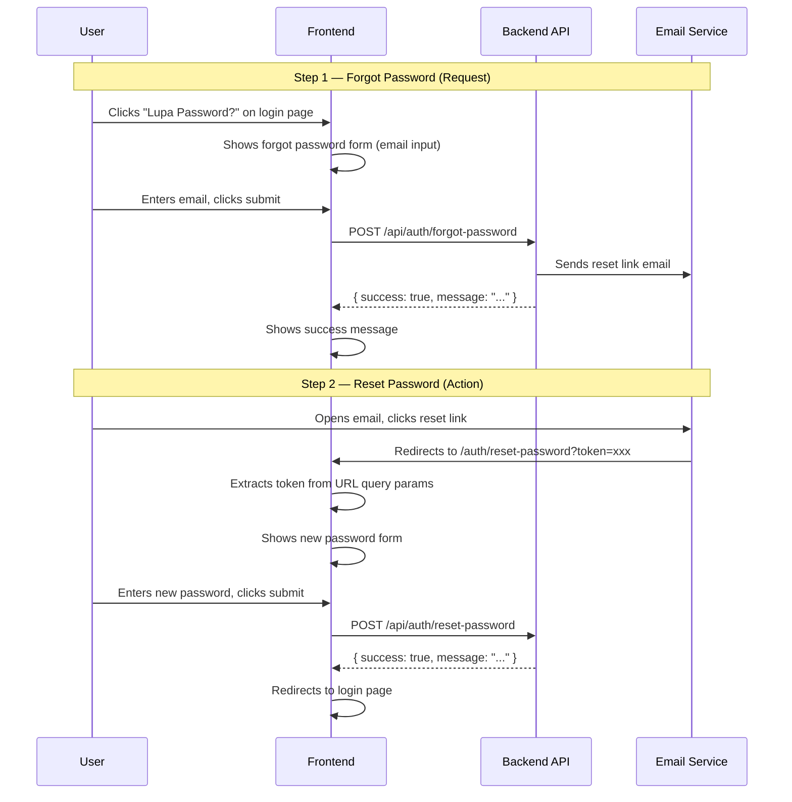

# Frontend Guide: Forgot & Reset Password Flow

## Overview

This is a **two-step flow** for unauthenticated users who forgot their password. No auth token/session is required.



---

## Step 1: Forgot Password Page

### Location
Login page → "Lupa Password?" link → navigates to `/auth/forgot-password` (or show as modal)

### UI Elements
- Email input field
- Submit button ("Kirim Link Reset")
- Back to login link

### API Call

```typescript
// POST /api/auth/forgot-password
// Content-Type: application/json
// No auth required

// Request Body
interface ForgotPasswordRequest {
  email: string; // valid email format
}

// Response (always 200 — prevents email enumeration)
interface ForgotPasswordResponse {
  success: true;
  message: "Jika email terdaftar, Anda akan menerima link reset password.";
}
```

### Frontend Logic

```typescript
const handleForgotPassword = async (email: string) => {
  try {
    const res = await fetch(`${API_BASE_URL}/api/auth/forgot-password`, {
      method: "POST",
      headers: { "Content-Type": "application/json" },
      body: JSON.stringify({ email }),
    });

    const data = await res.json();

    if (!res.ok) {
      // Validation error (invalid email format)
      // data.message contains the error
      showError(data.message);
      return;
    }

    // Always show success (even if email doesn't exist — security)
    showSuccess(data.message);
  } catch (error) {
    showError("Terjadi kesalahan. Silakan coba lagi.");
  }
};
```

### Validation (client-side)
- `email`: required, valid email format

### UX Notes
> [!IMPORTANT]
> Always show the **same success message** regardless of whether the email exists. This prevents attackers from discovering which emails are registered (email enumeration attack).

---

## Step 2: Reset Password Page

### Location
`/auth/reset-password?token=<reset_token>`

The user arrives here by clicking the **"Reset Password"** button in the email they received. The `token` is passed as a URL query parameter.

### UI Elements
- New password input field
- Confirm password input field (client-side only, not sent to API)
- Submit button ("Reset Password")

### API Call

```typescript
// POST /api/auth/reset-password
// Content-Type: application/json
// No auth required

// Request Body
interface ResetPasswordRequest {
  token: string;    // from URL query param ?token=xxx
  password: string; // min 8 chars, must contain uppercase + lowercase + number
}

// Success Response (200)
interface ResetPasswordSuccessResponse {
  success: true;
  message: "Password berhasil direset. Silakan login dengan password baru Anda.";
}

// Error Response (400)
interface ResetPasswordErrorResponse {
  success: false;
  message: string;
  // Possible messages:
  // - "Token reset password tidak valid atau sudah kedaluwarsa. Silakan minta reset password baru."
  // - "Password minimal 8 karakter"
  // - "Password harus mengandung huruf besar, huruf kecil, dan angka"
}
```

### Frontend Logic

```typescript
const handleResetPassword = async (password: string, confirmPassword: string) => {
  // 1. Client-side: confirm passwords match
  if (password !== confirmPassword) {
    showError("Password tidak cocok.");
    return;
  }

  // 2. Extract token from URL
  const params = new URLSearchParams(window.location.search);
  const token = params.get("token");

  if (!token) {
    showError("Token tidak ditemukan. Silakan minta reset password baru.");
    return;
  }

  try {
    const res = await fetch(`${API_BASE_URL}/api/auth/reset-password`, {
      method: "POST",
      headers: { "Content-Type": "application/json" },
      body: JSON.stringify({ token, password }),
    });

    const data = await res.json();

    if (!res.ok) {
      showError(data.message);
      return;
    }

    showSuccess(data.message);
    // Redirect to login after short delay
    setTimeout(() => router.push("/login"), 2000);
  } catch (error) {
    showError("Terjadi kesalahan. Silakan coba lagi.");
  }
};
```

### Validation (client-side)
| Field | Rule |
|---|---|
| `password` | Min 8 characters |
| `password` | Must contain at least 1 uppercase letter |
| `password` | Must contain at least 1 lowercase letter |
| `password` | Must contain at least 1 number |
| `confirmPassword` | Must match `password` (FE-only, not sent to API) |

Regex for password: `/^(?=.*[a-z])(?=.*[A-Z])(?=.*\d)/`

---

## Edge Cases to Handle

| Scenario | How to Handle |
|---|---|
| **No token in URL** | Show error + link to forgot password page |
| **Expired/invalid token** | API returns 400 → show error + link to request new reset |
| **User submits forgot password for non-existent email** | API returns same success message (security) |
| **Google OAuth user tries forgot password** | API returns same success message (no email sent, they won't receive anything) |
| **Token already used** | Same as expired token — token is cleared after successful reset |

---

## Summary of Routes

| Route | Type | Purpose |
|---|---|---|
| `POST /api/auth/forgot-password` | Public | Send reset email |
| `POST /api/auth/reset-password` | Public | Set new password with token |

## Summary of FE Pages

| Page Route | Purpose | Accessed From |
|---|---|---|
| `/auth/forgot-password` | Email input form | Login page "Lupa Password?" link |
| `/auth/reset-password?token=xxx` | New password form | Email reset link |

> [!TIP]
> The reset token **expires after 1 hour**. If the user waits too long, they'll need to request a new one from the forgot password page.
